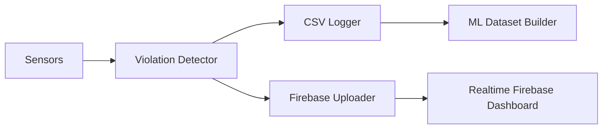

# CARLA Traffic Violation Detection and Cloud Analytics System


## Table of Contents
- [System Overview](#system-overview)
- [Version Compatibility](#version-compatibility)
- [Key Features](#key-features)
- [Technical Architecture](#technical-architecture)
- [Installation Guide](#installation-guide)
- [Configuration](#configuration)
- [Usage](#usage)
- [Firebase Integration](#firebase-integration)
- [Data Analytics](#data-analytics)
- [Troubleshooting](#troubleshooting)
- [License](#license)

---

## System Overview

This project delivers a high-fidelity traffic violation detection system by integrating the CARLA simulator with cloud-based real-time analytics using Firebase. The system simulates urban traffic with autonomous vehicles, monitors behavior using mounted sensors, detects violations, logs telemetry data locally, and streams structured violation events to a Firebase dashboard.

**Script Entry Point**: `./PythonAPI/examples/traffic_violation_detection.py`

---

## Version Compatibility

- ✅ **Tested with**: CARLA `0.9.15` to `0.9.15.2`
- ⚠️ **Incompatible with**: CARLA `0.10.0+` (due to major API changes)

### Recommended Setup:
- **CARLA**: `0.9.15.2`
- **Python**: `3.7.x`
- **OS**: Windows or Ubuntu 20.04+

---

## Key Features

### 🚦 Core Detection Capabilities
- **Speeding**
- **Red Light Violations**
- **Wrong-Way Driving**
- **Lane Violations**
- **Collision Detection**
- **Real-Time Alerts via Firebase**

### 📡 Sensor Suite per Vehicle
- LiDAR, IMU, GNSS, Collision Detector, Lane Invasion Sensor

---

## Technical Architecture

> Note: Mermaid diagrams render only in compatible Markdown viewers (e.g., GitHub with beta features enabled).



---

## Installation Guide

### 1. Clone CARLA Repository

```bash
git clone https://github.com/carla-simulator/carla.git
cd carla
git checkout 0.9.15.2
```

### 2. Download CARLA Precompiled Binaries (Recommended)

**Windows:**
```bash
wget https://carla-releases.s3.eu-west-3.amazonaws.com/Windows/CARLA_0.9.15.2.zip
Expand-Archive CARLA_0.9.15.2.zip -DestinationPath C:\CARLA
```

**Linux:**
```bash
wget https://carla-releases.s3.eu-west-3.amazonaws.com/Linux/CARLA_0.9.15.2.tar.gz
tar -xvzf CARLA_0.9.15.2.tar.gz -C ~/carla
```

### 3. Set Up Python Virtual Environment

```bash
python3.7 -m venv carla_env
# Activate the environment
source carla_env/bin/activate     # Linux
carla_env\Scripts\activate        # Windows
pip install -r requirements.txt
```

### 4. Configure Python Path

**Windows:**
```cmd
set PYTHONPATH=%PYTHONPATH%;C:\CARLA\PythonAPI\carla;C:\scenario_runner
```

**Linux:**
```bash
export PYTHONPATH=$PYTHONPATH:~/carla/PythonAPI/carla:~/scenario_runner
```

---

## Configuration

- Place `traffic_violation_detection.py` in `CARLA/PythonAPI/examples`
- Add Firebase credentials to: `config/firebase.json`
- Detection thresholds and sensor configs can be edited in the script

---

## Usage

### 1. Launch CARLA Server

**Linux:**
```bash
./CarlaUE4.sh -quality-level=Low
```

**Windows:**
```cmd
CarlaUE4.exe -dx11 -quality-level=Low
```

### 2. Start Detection Script

```bash
python PythonAPI/examples/traffic_violation_detection.py \
    --town Town03 \
    --vehicles 25 \
    --duration 60
```

---

## Firebase Integration

Firebase enables real-time visualization and storage of violations.

### Steps:
1. Create a project at [firebase.google.com](https://firebase.google.com)
2. Enable **Realtime Database** (not Firestore)
3. Download credentials file and save it as:
   ```
   config/firebase.json
   ```
4. The script will auto-connect and push data

### Logged Fields:
- `vehicle_id`, `timestamp`, `violation_type`, `GPS`, `speed`, `IMU`, `LiDAR`, `collision_partner`, etc.

📊 **Firebase Console**:  
Visit [Firebase Realtime Database Console](https://carla-4f285-default-rtdb.firebaseio.com/)

---

## Data Analytics

- Logs stored in: `traffic_violations_detailed.csv`
- Useful for:
  - ML model training
  - Behavioral pattern analysis
- Sample columns:
  - Timestamp, Vehicle ID, Speed, Throttle, Violation Type, GPS, IMU, LiDAR

---

## Troubleshooting

- **CARLA Not Launching**:
  - Check DirectX 11 (Windows) or Vulkan (Linux) installation
  - Ensure GPU meets CARLA's requirements

- **Python Issues**:
  - Confirm you're using Python 3.7
  - Ensure virtual environment is activated

- **Firebase Not Logging**:
  - Validate `.json` path
  - Check Firebase Database Rules (write access required)
---

## License

MIT License © 2025 [@aswathiir](https://github.com/aswathiir)

---

## Version Badges


---

> **Note**: This project includes only Python API components. CARLA simulator must be downloaded from [carla.org](https://carla.org).
